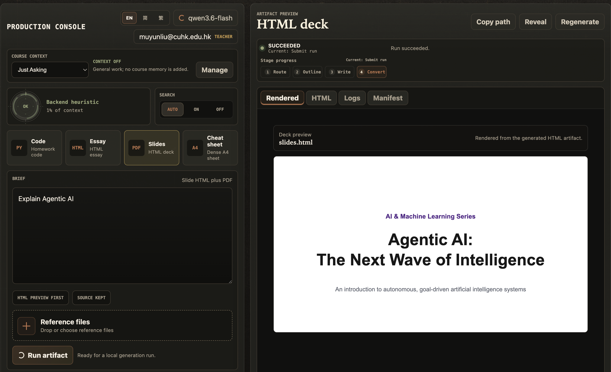

Status: Active
Last Reviewed: 2026-06-01

# Asset Prompts

Store prompts and generation notes for product visual assets here.

Each prompt file should follow `docs/CONTRACTS/visual-assets.md` and point to the intended output path under `frontend/src/assets/`.

Do not store real API keys, paid asset credentials, or private uploaded course materials in this folder.

## Product Direction

AI Learning Assistant should feel like a precise academic artifact studio: warm graphite surfaces, paper-like preview textures, serif editorial titles, crisp editor details, clay/terracotta emphasis, and restrained status color. It should not look like a generic dark SaaS dashboard, a course admin panel, a support chatbot, a sci-fi interface, or a marketing landing page.

The visual system may learn from warm, literary AI interfaces such as Claude, especially serif warmth and restraint, but the assets must not copy proprietary typefaces, exact color systems, icons, brand marks, or distinctive layouts.

The signature composition is a conversational production console beside a persistent artifact preview panel. Assets should reinforce that the right side is the current generated work product.

Existing frontend placeholder art and style treatments are disposable. Use these briefs as the visual source of truth for the rebuild instead of preserving current assets for continuity.

Use assets to reveal product state:

- context budget and warning level
- artifact type and output format
- source-to-output generation progress
- preserved files after success or failure

Avoid vague abstract blobs, decorative gradients, fake charts, stock classroom imagery, private course material, real student names, or real university marks.

Avoid readable UI text inside generated images. The frontend must localize English, Simplified Chinese (`zh-Hans`), and Traditional Chinese (`zh-Hant`) through real UI text, so image assets should use unreadable microtext or neutral placeholders only.

## Initial Prompt Briefs

- `visual-system.md` -> stable direction for colors, typography, spacing, and asset use
- `workbench-background-texture.md` -> `frontend/src/assets/textures/workbench-background-texture.png`
- `context-budget-dial-states.md` -> `frontend/src/assets/previews/context-budget-dial-{ok,warning,critical}.png`
- `artifact-preview-visuals.md` -> `frontend/src/assets/previews/artifact-preview-{code,essay,slides,cheat-sheet}.png`
- `auth-and-empty-states.md` -> `frontend/src/assets/previews/auth-entry-preview.png`, `frontend/src/assets/previews/empty-workbench-preview.png`
- `workbench-motion.md` -> `frontend/src/assets/motion/preview-hydration.json`, `frontend/src/assets/motion/revision-swap.json`
- Generated PNG assets are stored under `frontend/src/assets/` using the target paths listed in each prompt brief.

Motion assets are optional in phase 1, but any committed motion should be purposeful, reduced-motion-aware, and tied to generation or preview state.
